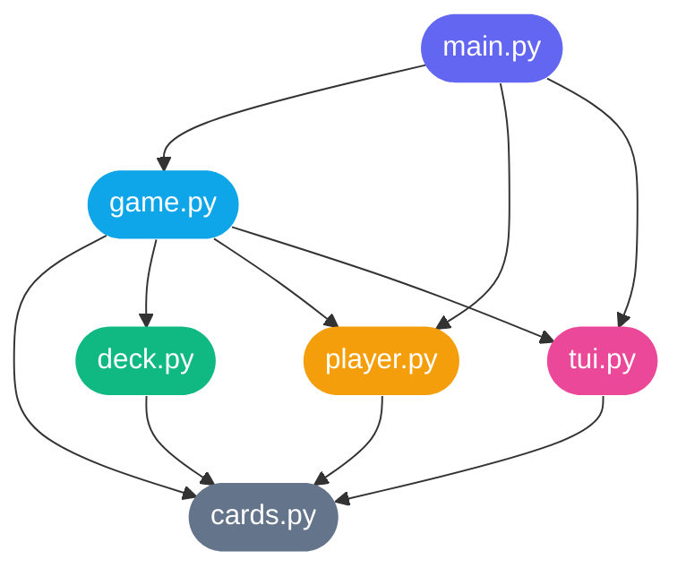
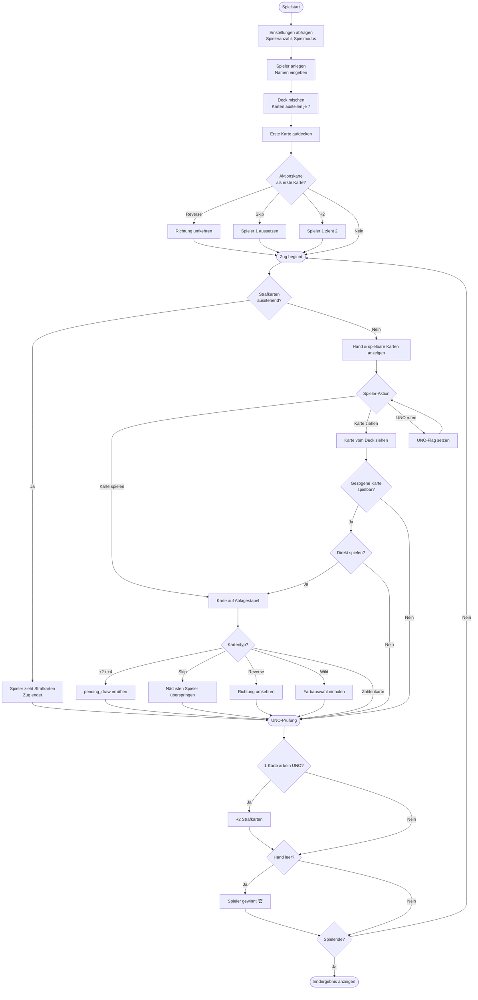
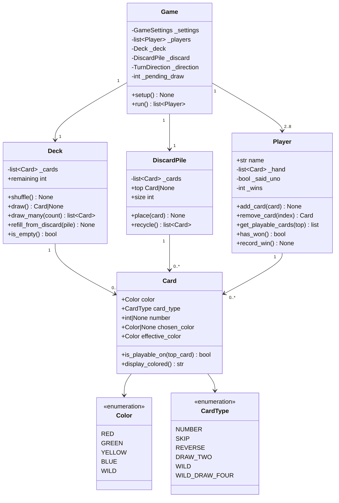

# 🃏 UNO – Das Kartenspiel

Ein vollständiges UNO-Spiel für das Terminal, geschrieben in Python 3.10+.  
Unterstützt 2–8 Spieler, farbige ANSI-Ausgabe und alle klassischen Sonderkarten.

---

## 🚀 Schnellstart

```bash
# Kein externes Paket nötig – nur Python 3.10+
python3 main.py
```

---

## 📁 Projektstruktur

```
uno/
├── main.py      # Einstiegspunkt – Spielschleife & Wiederholung
├── game.py      # Spiellogik-Engine (Züge, Effekte, Gewinner)
├── cards.py     # Datenmodell: Card, Color, CardType
├── deck.py      # Deck (Ziehstapel) & DiscardPile (Ablagestapel)
├── player.py    # Player-Klasse mit Hand-Management
└── tui.py       # Terminal-UI: Ausgaben, Eingaben, ANSI-Farben
```

---

## 🏗️ Architektur – Modulabhängigkeiten



---

## 🔄 Spielablauf



---

## 🃏 Kartenübersicht



---

## ⚙️ Spielregeln (Implementiert)

| Karte | Effekt |
|---|---|
| **Zahlenkarte** | Muss Farbe oder Zahl der obersten Karte treffen |
| **Skip** | Nächster Spieler setzt aus |
| **Reverse** | Spielrichtung dreht sich um (bei 2 Spielern = Skip) |
| **+2** | Nächster Spieler zieht 2 Karten und setzt aus |
| **Wild** | Spieler wählt eine neue Farbe |
| **+4** | Spieler wählt Farbe + Nächster zieht 4 Karten |
| **UNO vergessen** | +2 Strafkarten bei 1 Karte ohne UNO-Ruf |

---

## 🎮 Steuerung im Spiel

```
[1–N]   Spielbare Karte legen
[z]     Karte vom Stapel ziehen
[u]     UNO! rufen
[1–4]   Farbwahl bei Wild-Karten (Rot / Grün / Gelb / Blau)
```

---

## 🐍 Voraussetzungen

- Python **3.10** oder neuer (wegen `int | None` Union-Syntax)
- Keine externen Bibliotheken erforderlich
- Terminal mit ANSI-Farbunterstützung empfohlen (macOS, Linux, Windows Terminal)
